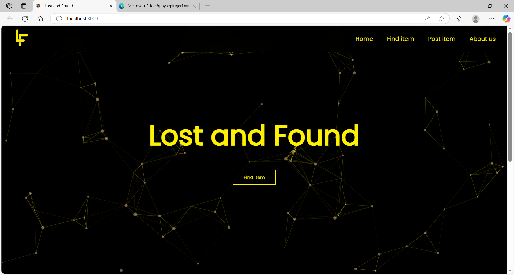
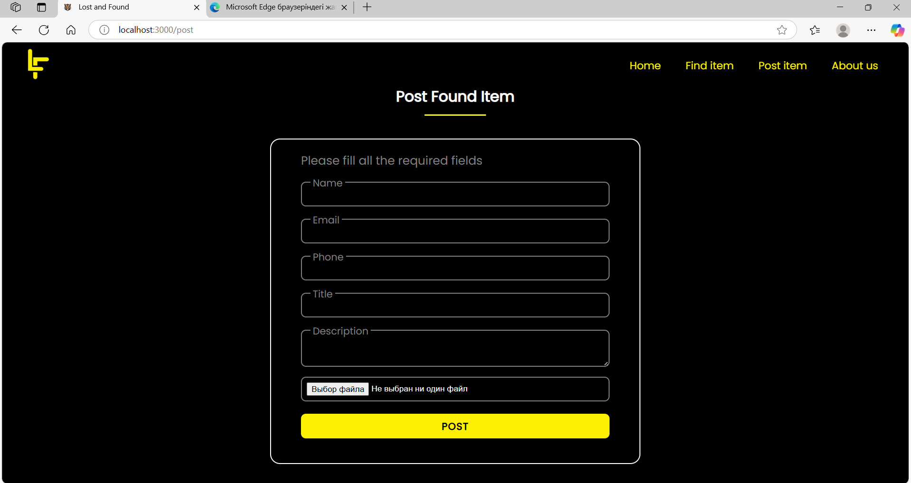
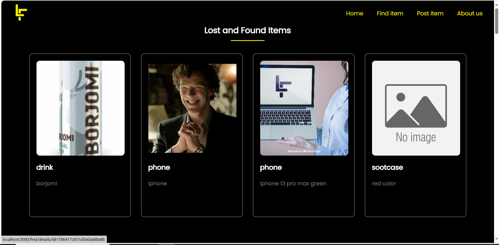
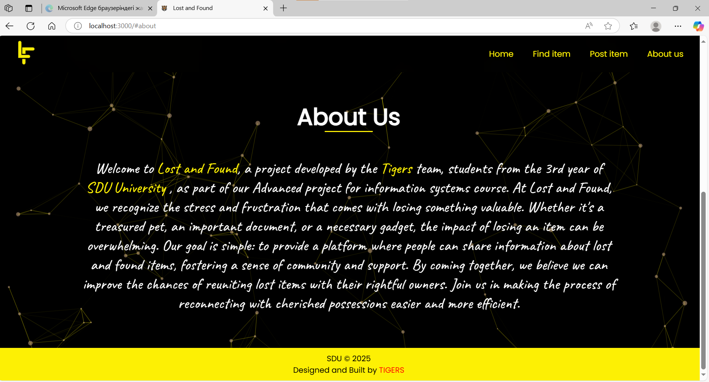

# Lost And Found

## Project Description:
The Lost and Found  is a project developed by the 17-P team, third-year students of SDU, as part of our Advanced project for information systems course. This initiative aims to address a common challenge in our community: reuniting people with their lost items, pets, or belongings. Our mission is to create a platform that simplifies the process of sharing and finding information about lost or found items, fostering a supportive and connected community.

## Project Objectives
- **Create a User-Friendly Platform:** Develop and maintain a user-friendly website that allows community members to easily post information about lost or found items.
- **Foster Community Support:** Encourage community members to support each other in finding and reuniting with their lost items.
- **Reunite Owners with Lost Belongings:** Facilitate the reunification of lost items, pets, and belongings with their owners.
- **Promote Community Engagement:** Actively engage with the local community to promote the use of the Lost and Found Bulletin Board.
- **Provide Ongoing Support:** Continuously maintain and improve the platform to ensure it remains a valuable resource for the community.  
  
### Languages Used:
#### Front end :   
#### Backend :  
#### Database :  <br />


### Usage Guide

Report a lost item by submitting a form with item details.

Report a found item with item description and optional image.

Browse lost/found item listings.


### Testing
To run tests (if available), use:
```
npm test
```

### Known Issues / Limitations
Email notifications are not implemented.
NO Register or log in as a user.
NO search bar and filters for quick item discovery.


## Installation

### Step 1: Clone the Repository

```bash
git clone https://github.com/Aldanak71/LostFound_17P.git

```
### Install server dependencies
```console cd server
cd backend
npm install
```
### Install client dependencies
```console
cd frontend
npm install
```
### Start the server
```console
cd backend
npm start
```
### Start the client
```console
cd frontend
npm start
```
```python
The server will run on http://localhost:8000, and the client will be available at http://localhost:3000
```

### Team Members

Aldanak Bauyrzhan, 220103309, 17-P

Aitbai Zhalgas, 22003224, 17-P

Mussabek Aidynbek, 220103108, 17-P

Aitzhan Adilet, 220103229, 17-P

### screenshots



